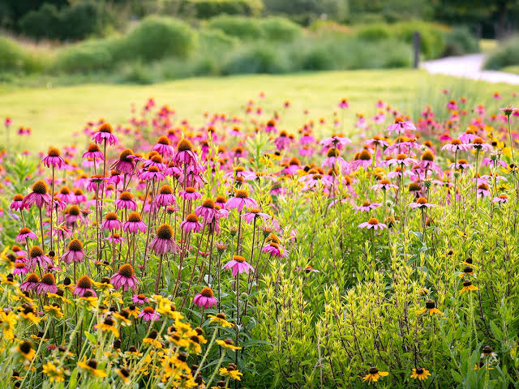

# Lady Bird Johnson Wildflower Center Infographic: exploring volunteer-collected data

Author: Ava Robillard

This repository contains an analysis of a provided dataset of plants in bloom at the Wildflower Center from 2011 to 2026, answering questions related to changes in phenology over time and the most commonly observed species throughout the year. The plots created in this repository will be used in an infographic design in Affinity.



## Repository Structure

```         
wildflower-phenology
├── README.md
├── data
├── assets 
├── 01_datacleaning.qmd   # Data cleaning
├── 02_exploration.qmd    # Drafting preliminary visualizations
└── wildflower-phenology.Rproj
```

## Data

There is always something blooming, growing, making seeds, or just collecting beautiful drops of dew at the Wildflower Center, and volunteers have created a list of 1-24 of these species approximately each week from 2011 to present day. This data is publicly available on the ["What's in Season"](https://www.wildflower.org/whatsinseason/?wib_date=2021-12-17) page of the Wildflower Center website, but was provided in spreadsheet form for this analysis.

## References

Thank you to Emma Ericksen for providing this data in an accessible format!
